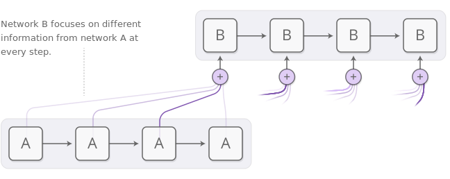

> *augmented* RNNs

* Notes:

    - Notable augmentation of RNNs:
        - Neural Turing Machines. Have external memory that they can read and write to.
        - Attentional Interfaces. Allow RNNs to focus on parts of their input.
        - Adaptive Computation Time. Allows for varying amounts of computation per step.
        - Neural Programmers. Can call functions, building programs as they run.

    - Neural Training Machines. Combine a RNN with an external memory bank, which is an array of vectors.
        
        
        - NTMs, at each step, read and write everywhere, just to differnet extents. For example for 
            reading, instead of single location, the RNN outputs an "attention distribution" that describes 
            how we spread out the amount we care about different memory positions. As such the result 
            of the read operation is a weighted sum. For writing the RNN gives an attention distribution, 
            describing how much we should change each memory position towards the new write value.

        - Read and write capability allows NTMs to perform many simple algorithms, previously beyond neural networks.
            They can mimic a lookup table, learn to srot numbers, with modifications, they can add and multiply numbers, etc.

    - Attentional Interfaces. Neural networks using *attention* focus on part of a subset of the information they're given. 
        For example, an RNN can attend over the output of another RNN. At every time step, it focuses on different positions 
        in the other RNN. This attention, preferably is differentiable, so that we can learn where to focus, for this, we focus 
        everywhere, just to different extents.
        

---
* References:

    - [Attention and Augmented Recurrent Neural Networks](https://distill.pub/2016/augmented-rnns/)
